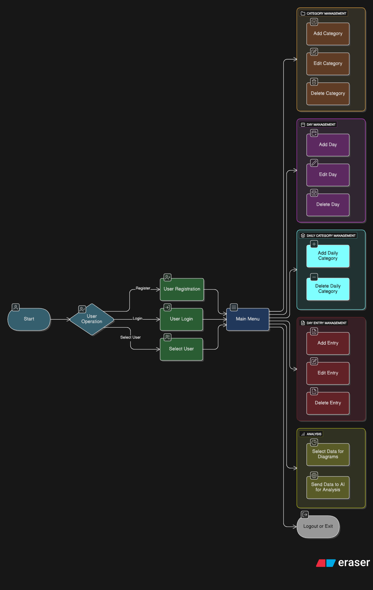
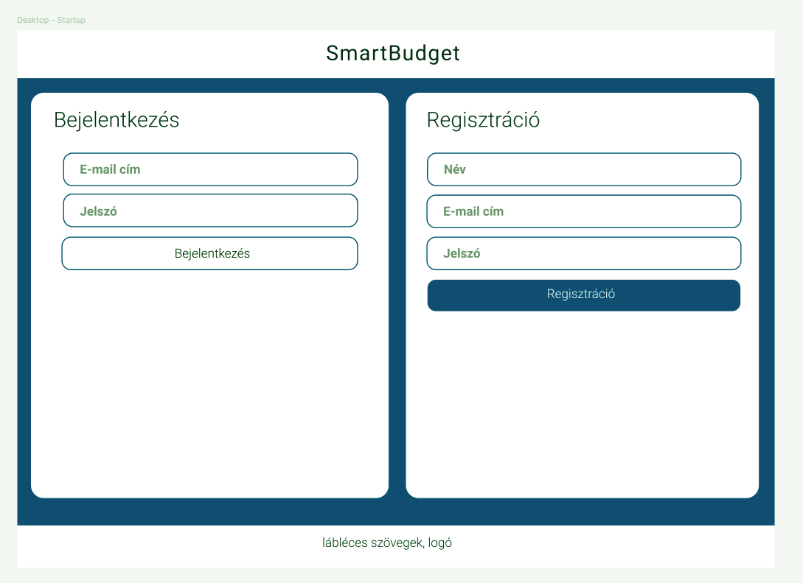
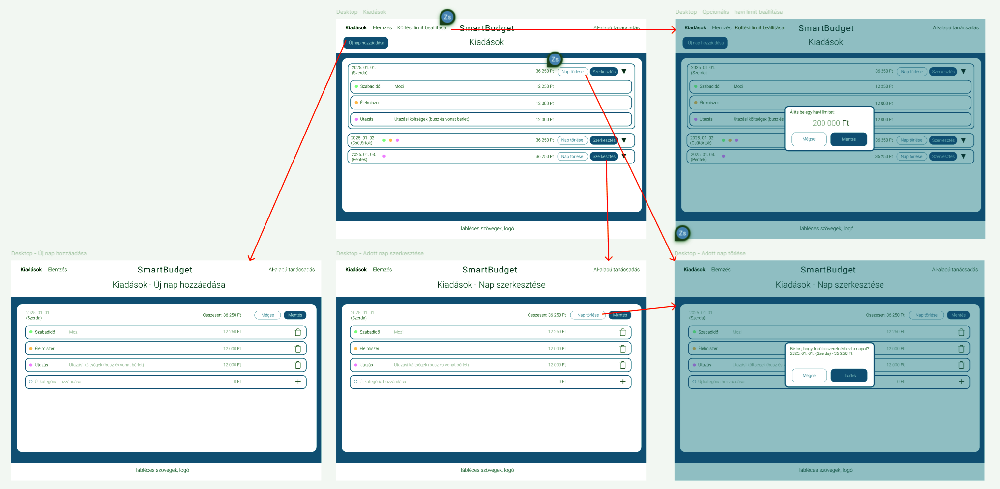
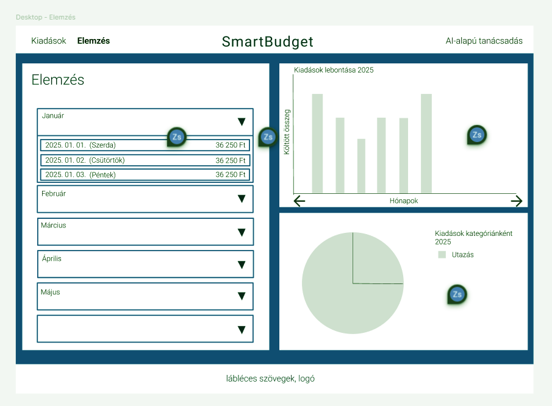
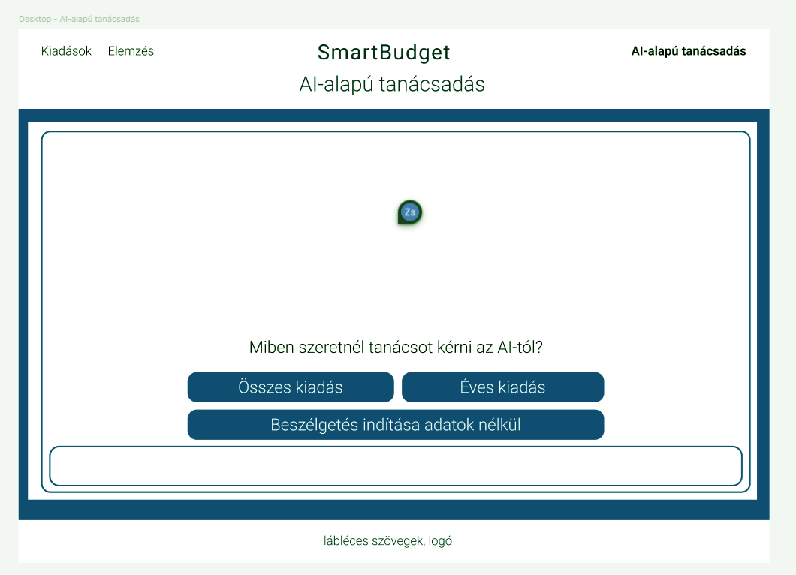
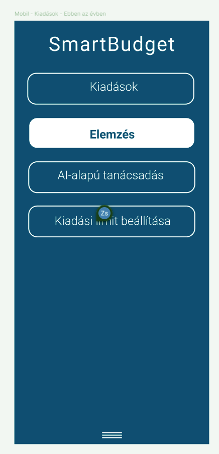
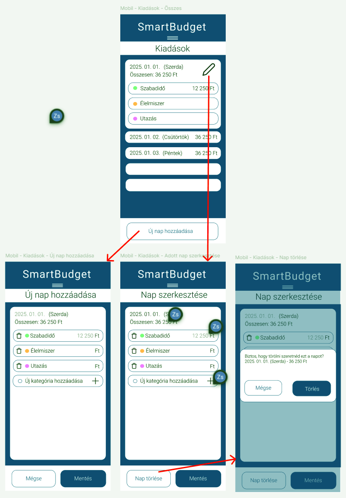
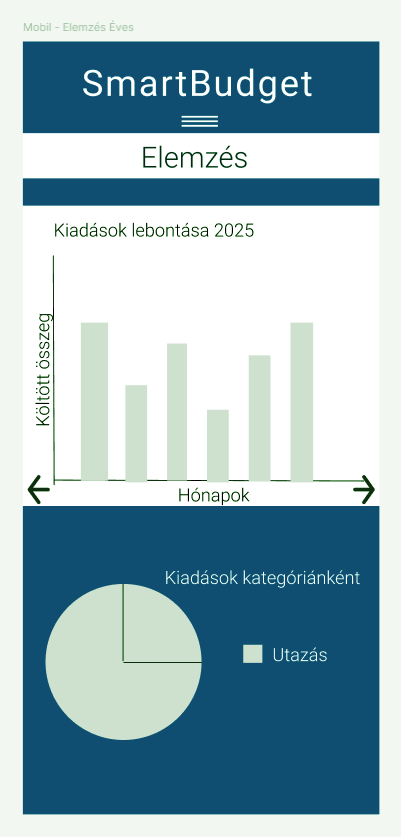
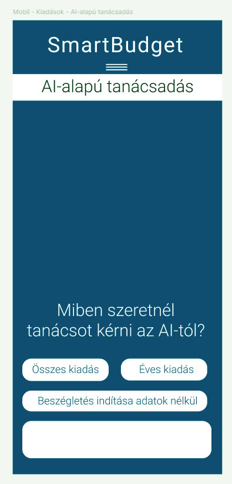
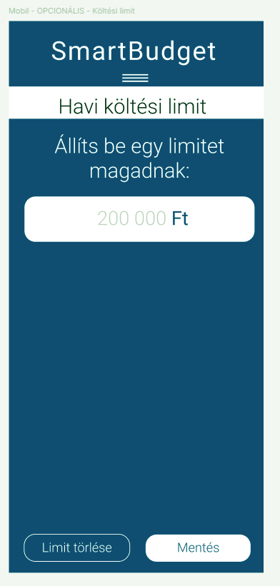

# 2. Rendszerjavaslat

## 2.1. Funkcionális specifikáció

### Hivatkozások
A funkcionális specifikáció alapja a **1. Követelményspecifikáció**, amely tartalmazza a jelenlegi helyzet leírását, a vágyálomrendszert, a jogi előírásokat, valamint a funkcionális és nemfunkcionális követelménylistát. A jelenlegi dokumentum a felhasználói folyamatokra és a rendszer logikai felépítésére fókuszál.

---

## 2.1.1 Jelenlegi helyzet
A felhasználók jelenleg manuálisan, elemzési lehetőségek nélkül vezetik pénzügyeiket. Hiányzik egy olyan automatizált megoldás, amely képes lenne összefüggéseket keresni a költések között és proaktív tanácsokat adni. (Hivatkozás: Követelményspecifikáció: 1.1 Jelenlegi helyzet leírása)

---

## 2.1.2 Vágyálomrendszer
A cél egy olyan **webes alkalmazás**, amely biztonságos profilkezelést, rugalmas adatbevitelt és a **Google Gemini AI** integrációjával intelligens pénzügyi asszisztenciát nyújt. A rendszer segít a kategóriák szerinti rendszerezésben és a vizuális átláthatóságban. (Hivatkozás: Követelményspecifikáció: 1.2 Vágyálomrendszer)

---

## 2.1.3 Rendszerre vonatkozó előírások
- **GDPR (EU 2016/679):** Személyes adatok védelme.
- **ISO/IEC 9126:** Szoftverminőségi szabványok.
- **WCAG 2.1:** Webes hozzáférhetőség.
- **Google Generative AI Terms of Service:** A Gemini AI API-ra vonatkozó felhasználási feltételek.
- **Flask és React nyílt forráskódú licenszek.**

---

## 2.1.4 Jelenlegi és igényelt üzleti folyamatok
- **Jelenlegi folyamatok:** Töredezett adatvezetés, elmaradó elemzések.
- **Igényelt folyamatok:** Felhasználói fiók létrehozása, strukturált költségrögzítés (napok és kategóriák szerint), automatizált grafikonok és AI-alapú pénzügyi coaching.

---

## 2.1.5 Funkciók és használati esetek

### Fő funkciók (menük, gombok, listák)

| Funkció | Leírás | UI elem |
|:---|:---|:---|
| **Profilkezelés** | Regisztráció és bejelentkezés a saját adatok eléréséhez. | "Register" / "Login" gombok, űrlapok |
| **Kategória kezelés** | Egyéni költségtípusok definiálása. | "Category Management" modul |
| **Időalapú rögzítés** | Kiadások napokhoz rendelése és rendszerezése. | "Day Management" felület |
| **Tranzakció kezelés** | Konkrét összegek felvitele, módosítása vagy törlése. | "Day Entry Management" űrlapok |
| **Vizuális elemzés** | Statisztikai adatok lekérése és diagramok generálása. | "Select Data for Diagrams" funkció |
| **Gemini AI tanácsadás** | Személyre szabott elemzés kérése a költések alapján. | "Send Data to AI for Analysis" gomb |
| **Kilépés** | Munkamenet biztonságos lezárása. | "Logout or Exit" gomb |

---

### Használati eset diagram (Use Case)
A rendszer folyamatait az alábbi diagram szemlélteti, a kezdőponttól (Start) a felhasználói műveleteken át (User Operation) a főmenüből elérhető funkciókig:

---

## 2.1.6 Képernyőtervek

A képernyőtervek a felhasználói felület logikai felépítését és az egyes modulok elhelyezkedését szemléltetik, biztosítva a reszponzív működést asztali és mobil környezetben egyaránt.

### 2.1.6.1 DESKTOP nézet

#### DESKTOP Startup (Hitelesítés)
Ezen a felületen történik a rendszerbe való belépés vagy az új profil létrehozása.
- **User Registration:** Regisztrációs űrlap (felhasználónév, jelszó).
- **User Login:** Bejelentkezési felület meglévő adatokkal.

#### DESKTOP Főoldal (Kiadások és Kezelés)
A központi interfész, amely a **Main Menu** funkcióit integrálja.
- **Category Management:** Új kategória hozzáadása, szerkesztése vagy törlése.
- **Day Management:** Napok kezelése és kiválasztása.
- **Day Entry Management:** Tranzakciók (összeg, leírás) rögzítése és módosítása.
- **Havi limit**

#### DESKTOP Elemzés oldal (Analysis)
- **Select Data for Diagrams:** Éves szűrés kiadásokra és kategóriás lebontás
- **Vizuális megjelenítés:** Interaktív oszlop- és kördiagramok a kiadások megoszlásáról.

#### DESKTOP AI Tanácsadó (Google Gemini AI)
- **Send Data to AI:** Gomb az adatok elemzésre küldéshez.
- **Személyre szabott riport:** A **Google Gemini AI** által generált szöveges elemzés és megtakarítási javaslatok.

---

### 2.1.6.2 MOBIL nézet

A mobil nézet követi a desktop funkcióit, de függőleges elrendezéssel és egyszerűsített navigációval segíti a gyors adatbevitelt.

#### MOBIL Startup
- Kompakt bejelentkezési és regisztrációs felület.

#### MOBIL Navigációs menü
- Oldalsó vagy alsó menüsor a gyors váltáshoz: *Kiadások, Elemzés, Gemini AI, Havi limit.*

#### MOBIL Kiadások (Tranzakció rögzítés)
- Gyors beviteli mezők az **Add Entry** funkcióhoz, kategóriaválasztó legördülő menüvel.

#### MOBIL Elemzés és Statisztika
- Görgethető grafikonok és összefoglaló adatok a havi költésekről.

#### MOBIL AI Asszisztens (Gemini AI)
- Chat-szerű vagy kártya alapú felület a mesterséges intelligencia válaszaihoz.

#### MOBIL Beállítások és Limit
- Havi költési korlát beállítása a navigációs menüből elérhető külön képernyőn.

---

### Forgatókönyv példa

**Forgatókönyv neve:** Regisztráció és első AI elemzés kérése

1. A felhasználó megnyitja az alkalmazást és a **User Registration** opciót választja.
2. A sikeres regisztráció után a **User Login** felületen bejelentkezik.
3. A **Main Menu**-be érve létrehoz egy új kategóriát a **Category Management** segítségével.
4. A **Day Management** menüpontban kiválaszt egy napot, majd az **Add Entry** gombbal rögzíti a kiadását.
5. A felhasználó az **Analysis** szekcióba lép, ahol a rendszer elküldi az adatokat a **Google Gemini AI**-nak.
6. A Gemini AI feldolgozza a tranzakciót és szöveges tanácsot jelenít meg a képernyőn.
7. A felhasználó a **Logout** gombbal elhagyja az alkalmazást.

---

### Funkció – követelmény megfeleltetés

| Funkcionális követelmény (1.6.1) | Funkció a rendszerben (Use Case alapján) |
|:---|:---|
| **F01 – Regisztráció/Login** | User Registration & User Login modulok |
| **F02 – Kategória kezelés** | Category Management (Add/Edit/Delete Category) |
| **F03 – Kiadások bevitele** | Day Management & Day Entry Management |
| **F04 – Grafikon készítése** | Analysis: Select Data for Diagrams |
| **F05 – AI elemzés** | Analysis: Send Data to AI (Google Gemini) |
| **F09 – Szerkesztés/Törlés** | Edit/Delete funkciók minden modulban |

---

## 7. Fogalomszótár

| Fogalom | Jelentés |
|:---|:---|
| **Gemini AI** | A Google fejlett mesterséges intelligenciája, amely a pénzügyi tanácsadásért felel. |
| **User Operation** | A belépési folyamatok (regisztráció, belépés, profilváltás) gyűjtőneve. |
| **Day Entry** | Egy konkrét naphoz tartozó pénzügyi tétel (összeg + leírás). |
| **Main Menu** | A rendszer központi elosztó felülete, ahonnan minden funkció elérhető. |