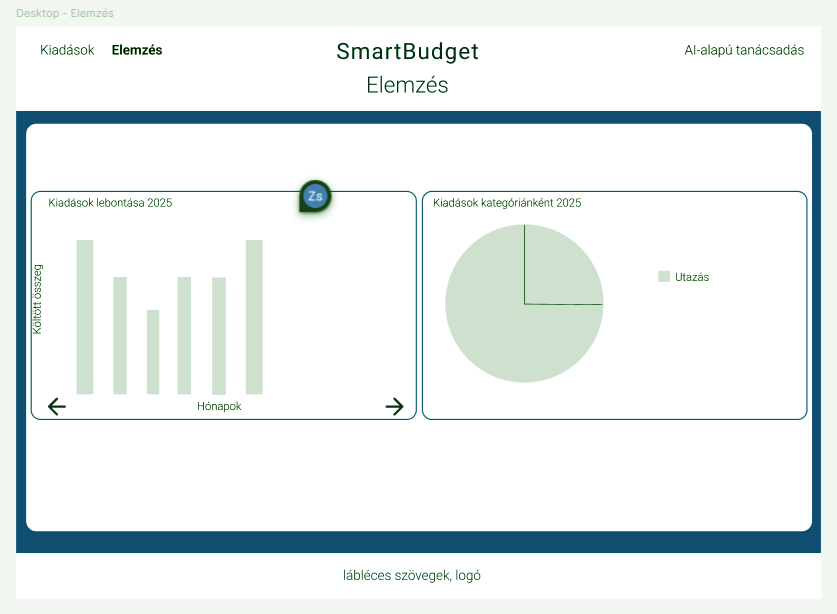
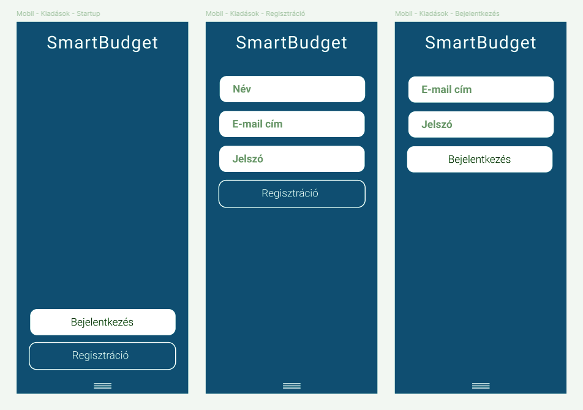

# 2. Rendszerjavaslat

## 2.1. Funkcionális specifikáció

### Hivatkozások
A funkcionális specifikáció alapja a **1. Követelményspecifikáció**, amely tartalmazza:
- a jelenlegi helyzet leírását,
- a vágyálomrendszert,
- jogi és szabványi előírásokat,
- üzleti folyamatok modelljét,
- funkcionális és nemfunkcionális követelménylistát.

A következő részben a felhasználó szemszögéből írjuk le a rendszert, a használati esetekre és képernyőtervekre fókuszálva.

---

## 2.1.1 Jelenlegi helyzet
A felhasználók jelenleg manuálisan vezetik költségeiket Excelben vagy jegyzetfüzetben, az adatok nem kerülnek elemzésre, nincs automatikus pénzügyi tanácsadás. A pénzügyi döntések nem adatvezéreltek. (Hivatkozás: 1.1 Jelenlegi helyzet leírása)

---

## 2.1.2 Vágyálomrendszer
A felhasználó számára egy **webes felület** biztosítja:
- költségek bevitelét (összeg, kategória, dátum, megjegyzés),
- valós idejű grafikonos megjelenítést,
- AI alapú elemzést és személyre szabott tanácsokat.

(Hivatkozás: 1.2 Vágyálomrendszer)

---

## 2.1.3 Rendszerre vonatkozó előírások
- GDPR megfelelés, ha felhasználói adatok kerülnek tárolásra
- ISO/IEC 9126 minőségi irányelvek
- WCAG 2.1 reszponzív webes hozzáférhetőség
- OpenAI API használati feltételek
- Flask és React nyílt forráskódú licenszek

(Hivatkozás: 1.3 Rendszerre vonatkozó előírások)

---

## 2.1.4 Jelenlegi és igényelt üzleti folyamatok
- **Jelenlegi folyamatok:** manuális kiadásvezetés, nincs elemzés
- **Igényelt folyamatok:** webes adatbevitel, kategorizálás, grafikonos összegzés, AI alapú pénzügyi tanácsadás  

(Hivatkozás: 1.4 Jelenlegi- és 1.5 Igényelt üzleti folyamatok)

---

## 2.1.5 Funkciók és használati esetek

### Fő funkciók (menük, gombok, listák)
| Funkció | Leírás | UI elem |
|---------|--------|---------|
| Kiadás rögzítése | Új költség bevitele (összeg, kategória, dátum, megjegyzés) | Űrlap (Form), "Mentés" gomb |
| Kiadások listázása | A korábbi kiadások megtekintése | Szűrés |
| Kategóriánkénti statisztika | Összesítés és grafikon készítése | Pie chart, bar chart |
| AI elemzés | Költségek AI által történő elemzése és tanácsadás | Gombok, szöveges kártyák |
| Bejegyzés szerkesztés/törlés | Meglévő kiadás módosítása vagy törlése | "Szerkesztés" és "Törlés" gomb |

---

### Használati eset diagram
**Használati esetek (Use Case)**

---

### Forgatókönyv példa

**Forgatókönyv neve:** Havi költség elemzése  

1. A felhasználó bejelentkezik.
2. A felhasználó rögzíti az összes havi költést az űrlapon.  
3. A rendszer elmenti az adatokat a backend SQLite adatbázisába.  
4. A felhasználó megtekinti a kiadások grafikonos összegzését.  
5. A felhasználó az "AI-alapú tanácsadás" gombra kattint.  
6. Az AI elemzés visszaadja a kért szöveges pénzügyi tanácsokat.  
7. Az eredmény megjelenik a felhasználó felületén.

---

### Funkció – követelmény megfeleltetés

| Funkcionális követelmény (1.6.1) | Funkció a rendszerben |
|------------------------------------|---------------------|
| F1 – Kiadások bevitele | Kiadás rögzítése űrlap és "Mentés" gomb |
| F2 – Adatok mentése backendbe | SQLite adatbázis + Flask REST API |
| F3 – Kiadások listázása | Nézet, szűrés |
| F4 – Grafikon készítése | Pie/bar chart komponens |
| F5 – AI elemzés | AI-tanácsadás |
| F9 – Bejegyzés szerkesztés/törlés | "Szerkesztés" és "Törlés" gombok |
| F10 – Reszponzív felület | CSS + React reszponzív komponensek |

---

## 6. Képernyőtervek
### DESKTOP nézet
- DESKTOP Startup
    - Bejelentkezés és Regisztráció

- DESKTOP Kiadások (főoldal): 
    - Új nap hozzáadása,
    - Meglévő nap szerkesztése/törlése,
    - (opcionális) Havi limit beállítása

- DESKTOP Elemzés oldal
    - grafikonos összegzés (oszlop- ill. kördiagram)

- DESKTOP AI oldal

### MOBIL nézet

- MOBIL Startup (Bejelentkezés, Regisztráció)

- MOBIL Navigációs menü

- MOBIL Kiadások (főoldal)

- MOBIL Elemzés

- MOBIL AI

- MOBIL Limit beállítása (NAV. MENÜBŐL ÉRHETŐ EL)

---

## 7. Fogalomszótár
(Ugyanaz, mint a követelményspecifikációban, hivatkozva: 1.8 Fogalomszótár)
